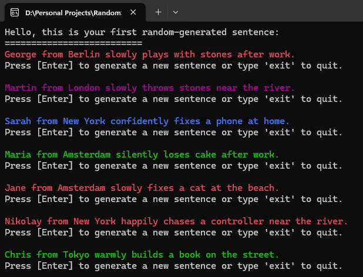

# 🎲 Random Sentence Generator (C#)

## 📌 Project Title
**Random Sentence Generator**  
A console-based C# application that generates fun and random sentences using predefined words.

---

## 🎯 Project Goals
The goal of this project is to create a simple and interactive console application that generates random sentences by combining names, places, actions, and details.

This project helps practice:
- Working with **arrays**
- Using **methods** for cleaner code
- Generating **random values**
- Console interaction and **text formatting**
- Basic project structure in **C#**

---

## 🛠️ Solution
The application generates sentences based on a predefined sentence structure:

---

### Example:
> Alex from Berlin confidently fixes a keyboard in the office.

### How it works:
- Words are stored in string arrays: `names`, `places`, `verbs`, `nouns`, `adverbs`, `details`
- A single `Random` instance is used to avoid repetition
- Separate methods handle:
  - Random word selection (`GetRandomWord`)
  - Sentence generation (`GenerateSentence`)
  - Console color randomization (`SetRandomColor`)
- The user can generate unlimited sentences or exit the program by typing `exit`

### Technologies & Tools:
- **C#**
- **.NET Console Application**
- **Visual Studio**

---

## 💻 Source Code
🔗 [View the source code on GitHub](https://github.com/MarkataaBG04/RandomSentenceByUser.git)  

---

## 📸 Screenshots
Below are example screenshots of the application in action:

---

## 🚀 Live Demo
This is a console application and does not have a live web demo.  
You can run it locally by:
1. Cloning the repository
2. Opening the project in Visual Studio
3. Running the application (`Ctrl + F5`)

---

## ✨ Features
- Random sentence generation
- Colorful console output
- Infinite sentence generation loop
- Exit command handling
- Clean and readable code structure

---

## 📚 Future Improvements
- Username-based sentence personalization
- Funny / serious modes
- Saving generated sentences to a file
- OOP-based refactor
- Rainbow or typing text effects
